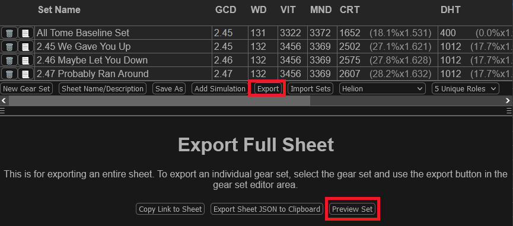
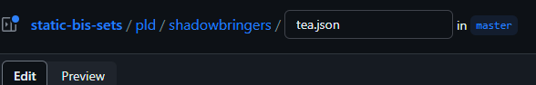

# Static BiS Lists for Xivgear.app

This repository contains BiS lists accessible by links such as [https://xivgear.app/#/bis/sge/endwalker/anabaseios](https://xivgear.app/#/bis/sge/endwalker/anabaseios).

By storing BiS here, it can easily be versioned, changes can be tracked, and the same link can be updated without needing to change resource
channels or website pages to link to the new BiS list.

## How to Use

First, set up your BiS sheet as you normally would on [Xivgear.app](https://xivgear.app).

Don't forget to include a descriptive title and description for both the top level sheet (at a minimum, it should explain what tier/ultimate the list is for),
and for each gear set (especially for healers, where you might wish to explain the different piety levels).

To edit the sheet title/description, click "Sheet Name/Description" under the table. If you don't see buttons under the table, click the hamburger menu to show them.

To edit a set title/description, select the set, then click "Change Name/Description" under the set title.

Once you're satisfied, preview the sheet by clicking Export > Preview Set:

Make sure everything looks good.

Then, on the export screen, click "Copy Set as JSON".

You can then modify or create a JSON file in this repository.

For example, if you wanted to add TEA BiS for PLD, it would go in `pld/shadowbringers/tea.json`. If the folders and files in question do not exist,
you will need to create them.

You can do all of this via the GitHub web interface. You must be logged in. To create a new file, simply click the "Add file" menu, then "Create new file".

In the top left, enter the file path. You can create the necessary folders in this manner - simply type 'pld/shadowbringers/tea.json', and it will
turn the slashes into folders:

Now, paste the JSON you copied earlier into this file. It will most likely be one (very long) line.

When you are done, click "Commit changes...". Enter a brief description of what you changed and why, and select the "Create a new branch for this commit and start a pull request":

Finally, click "Propose Changes". Click "Create pull request", and ping someone with it in discord to make sure they see it.